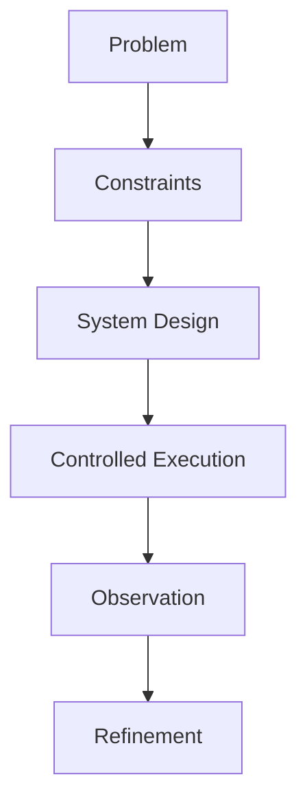

<!-- HEADER -->


<p align="center">
  
</p>

---

<!-- PROFILE CARD -->

<div align="center">


</div>

---

## 🧠 ABOUT SYSTEM


```txt id="about-block"
I don’t build apps first.

I design systems that:
→ expose behavior
→ guide decisions
→ prevent failure before it happens

Focus areas:
-  system design
-  controlled AI
-  cognitive load reduction
-  decision architectures
```

---

## ⚙️ SYSTEM ARCHITECTURE



---

## 🚀 SYSTEM LAYERS

<div align="center">

| Layer             | System      | Description               |
| ----------------- | ----------- | ------------------------- |
| ⚡ Behavior        | IARIS       | Adaptive control systems  |
| 🧠 Architecture   | AetherOS    | Modeling + simulation     |
| 🗺️ Understanding | CBCT        | Codebase mapping          |
| 🧰 Control        | PDTK        | Developer thinking system |
| 🏛️ Decision      | CIVISIM     | Policy simulation         |
| 🚨 Safety         | Guardian AI | Emergency AI              |
| 📚 Execution      | Mantessa    | Productivity system       |
| 🎓 Ecosystem      | Synapze     | Learning platform         |

</div>

---

## 🧠 DIFFERENCE

<div align="center">

| Others         | Me              |
| -------------- | --------------- |
| Build features | Design behavior |
| Use AI blindly | Control AI      |
| Fix problems   | Prevent them    |

</div>

---

## 📊 GITHUB ANALYTICS

<div align="center">

<table>
<tr>
<td width="48%" align="center" valign="top">


</td>
<td width="48%" align="center" valign="top">


</td>
</tr>
</table>


</div>

---

## 🐍 CONTRIBUTION FLOW

<div align="center">


</div>

---

## 🎯 CURRENT FOCUS

<div align="center">

🧠 System Design      ██████████
⚙️ AI Control        ████████░░
📊 Cognitive Systems  █████████░
🚀 Execution          ████████░░

</div>

---

## 🔗 CONNECT

<p align="center">
  <a href="[YOUR_LINKEDIN](https://www.linkedin.com/in/arin-gupta-2b94b032a/)">
    
  </a>
  <a href="mailto:aringupta2244@gmail.com">
    
  </a>
</p>

---


<p align="center">
  <i>Systems don’t fail instantly. They fail silently first.</i>
</p>
