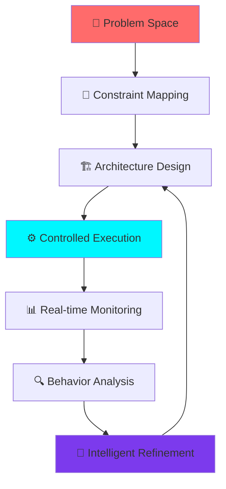
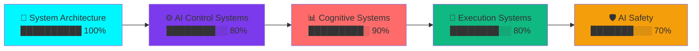

<!-- ========================================================= -->
<!--                       ARIN GUPTA README                   -->
<!--                    ULTIMATE SYSTEM DESIGNER               -->
<!-- ========================================================= -->

<p align="center">
  
</p>

<p align="center">
  
</p>

---

## 🚀 **CORE IDENTITY**

<p align="center">


</p>

<div align="center">
  
</div>

---

## 🌌 **SYSTEM MINDSET**

<div align="center">

</div>

```txt
🧠 I DON'T BUILD SOFTWARE AS PAGES & FEATURES
I BUILD LIVING SYSTEMS WITH:

🔄 BEHAVIOR           → Predictable evolution
⚡ DECISION FLOW      → Intelligent routing  
🏗️ ARCHITECTURE       → Failure-resistant
🎛️ CONTROL            → Precision engineering
🛡️ STABILITY          → Silent degradation prevention

🎯 FOCUS: Controlled AI + Cognitive Systems + Developer Tooling
```

---

## ⚡ **PHILOSOPHY MATRIX**

| **CONVENTIONAL** | **ARIN'S PARADIGM** |
|---|---|
| <kbd>Build → Ship → Patch</kbd> | <kbd>Design → Predict → Control</kbd> |
| <kbd>Features First</kbd> | <kbd>Systems First</kbd> |
| <kbd>AI Everywhere</kbd> | <kbd>Controlled AI</kbd> |
| <kbd>Fix When Broken</kbd> | <kbd>Prevent Silent Failures</kbd> |

---

## 🏗️ **SYSTEM DESIGN FLOW**



---

## 🔥 **LIVE SYSTEMS ECOSYSTEM**

<div align="center">

| **PROJECT** | **DOMAIN** | **STATUS** | **IMPACT** |
|-------------|------------|------------|------------|
| **IARIS** | AI Control | 🟢 Live | Adaptive AI regulation |
| **AetherOS** | System Design | 🟡 Alpha | Architecture simulation |
| **CBCT** | Dev Tools | 🟢 Live | Codebase navigation |
| **PDTK** | Productivity | 🟠 Beta | Cognitive workflows |
| **CIVISIM** | Simulation | 🟡 Alpha | Policy modeling |
| **Guardian AI** | AI Safety | 🟢 Live | Emergency AI |
| **Mantessa** | Execution | 🟠 Beta | Productivity orchestration |
| **Synapze** | EdTech | 🟡 Alpha | Adaptive learning |

</div>

---

## 🛠️ **TECH MASTERY STACK**

<p align="center">

</p>

---

## 📊 **ARCHITECTURE METRICS**

<p align="center">


</p>

<p align="center">

</p>

---

## 🚀 **SYSTEM STATUS DASHBOARD**

<div align="center">


</div>

---

## 🌐 **NEURAL CONNECTIONS**

<p align="center">
<a href="https://github.com/arin-gupta06">
  
</a>
<a href="https://www.linkedin.com/in/arin-gupta-2b94b032a/">
  
</a>
<a href="mailto:aringupta2244@gmail.com">
  
</a>

</p>

---

## 💎 **SYSTEM MANTRA**

<div align="center">

```txt
"Systems don't collapse suddenly.
They degrade silently first.

The architect's job:
Catch the silence before it screams."
```

</div>

<div align="center">


</div>

---

<p align="center">
  
</p>

<p align="center">

</p>
